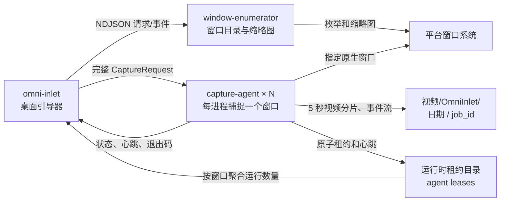
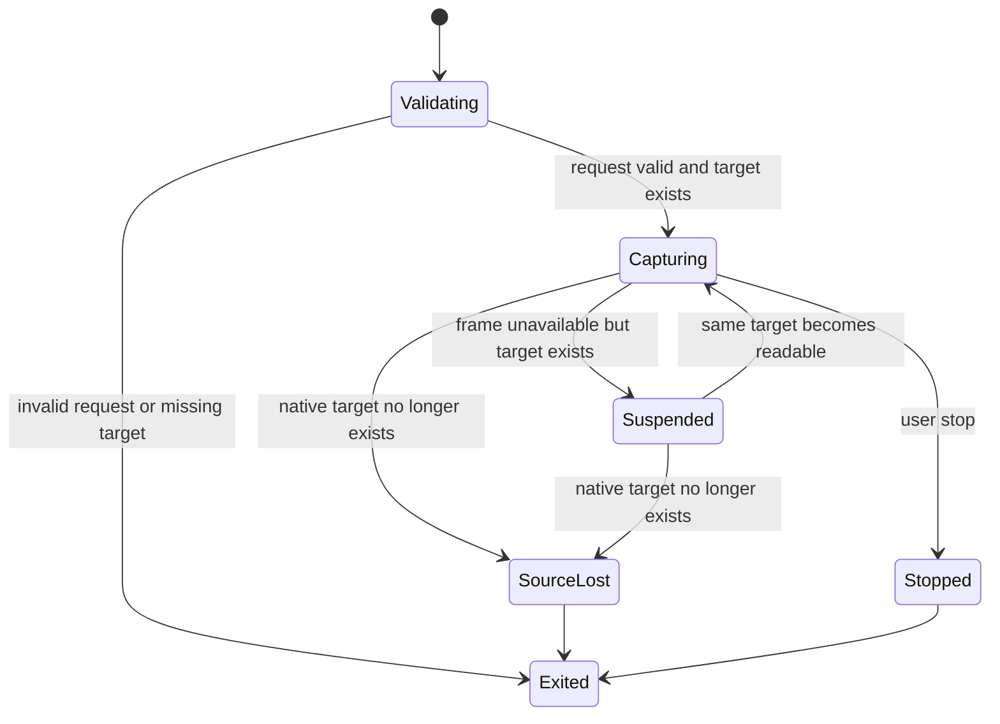

# OmniInlet 引导界面与运行架构

状态：第一版设计提案
日期：2026-08-02

本文负责产品交互和进程职责。标识符、租约去重、控制通道、平台后端、容量与构建等实现细节，以 [technical-architecture.md](technical-architecture.md) 为准。

## 1. 产品边界

OmniInlet 是运行在专用电脑上的窗口消息采集产品。第一阶段只负责：

1. 枚举当前桌面会话中可采集的应用窗口并生成缩略图。
2. 让用户明确选择一个窗口。
3. 以 10 FPS、5 秒一个视频分片的默认配置启动被动捕捉。
4. 展示采集进度、输出位置和中断原因。
5. 当原生窗口对象真正消失时，采集进程立即结束。

第一阶段不负责唤醒、恢复、点击或操纵聊天软件，也不把“窗口消失后出现的相似窗口”自动视为原窗口。

## 2. 三个可执行应用

采用三个边界明确的可执行程序。它们共享协议 crate，但不在同一进程中加载平台捕捉代码。

| 程序 | 责任 | 不负责 |
| --- | --- | --- |
| `omni-inlet` | 桌面引导器、窗口选择、默认目录、启动与监控多个采集子进程、聚合实时状态 | 直接枚举和捕捉像素 |
| `window-enumerator` | 枚举窗口、按应用归组、生成窗口缩略图、报告窗口增删变化 | 启动长期采集 |
| `capture-agent` | 校验启动参数、捕捉指定原生窗口、写视频分片与事件、窗口真正丢失时退出 | 选择窗口、猜测替代窗口 |



三个程序分开带来两个重要性质：平台枚举器崩溃不会污染正在进行的采集；捕捉器崩溃时，引导器仍能解释退出码并给用户明确反馈。

## 3. 引导器界面

### 3.1 窗口选择页

首屏不展示指标看板，以选择窗口为唯一主任务。

- 顶部：产品名、刷新按钮、窗口搜索。
- 搜索旁提供实时采集状态分段过滤：“全部 / 未采集 / 正在采集”，并显示符合条件的窗口数量。
- 主区：按应用分组，例如“微信（12，正在采集 4）”“QQ（23，正在采集 7）”。
- 每个应用组：应用图标、应用名称、总窗口数、正在采集的窗口数、折叠箭头，以及响应式网格。点击整个分组标题可以展开或折叠。
- 分组区顶部提供“全部展开 / 全部折叠”。搜索命中位于折叠组中的窗口时，临时展开该组；清空搜索后恢复用户之前的折叠状态。
- 每个窗口格：真实窗口缩略图；底部居中显示一行窗口标题，超长省略并提供悬停完整标题。
- 选中态：单一高对比描边和勾选标记，不使用多选。
- 当前只有一个采集器工作的窗口使用轻量“正在采集”标记；同时有多个采集器时显示“正在采集 (N)”。`N` 是正在捕捉该窗口的活跃 `capture-agent` 数量。
- 没有活跃采集器的窗口不额外贴标签。用户仍可选中正在采集的窗口，再启动一个独立采集器。
- 不可采集态：仍然显示，但缩略图降噪并标注“已隐藏”或“无可用画面”，不能启动。
- 底部固定操作区：当前选择、输出目录和“开始采集”。没有选择时主按钮禁用。

面对几十到上百个窗口时，界面只渲染可视区域附近的窗口卡片。应用分组保持稳定排序；采集器启动或退出时，窗口卡片的实时数量原地更新。开启“未采集”过滤时，采集器成功启动后该窗口从当前结果中淡出并把焦点移动到下一个可采集窗口。

默认输出目录由引导器解析系统标准视频目录，然后追加 `OmniInlet`：

- Windows：`FOLDERID_Videos/OmniInlet`
- macOS：`~/Movies/OmniInlet`
- Linux：`XDG_VIDEOS_DIR/OmniInlet`，不存在时回退到 `~/Videos/OmniInlet`

用户可以更改根目录；引导器在启动采集前按日期和 `job_id` 创建独占 job 目录，避免覆盖已有数据。

### 3.2 多采集器运行状态

启动一个采集器后，引导器保持窗口选择页，便于运维继续选择其他窗口。点击窗口卡片上的“正在采集 (N)”可以打开该窗口的轻量运行面板：

- 按 `agentId` 列出正在捕捉该窗口的所有采集器。
- 每个采集器展示状态、运行时间、已完成视频分片数、已录制时长和独立输出路径。
- 可以停止其中一个采集器，也可以停止该窗口的全部采集器；停止全部需要二次确认。

窗口最小化或隐藏、但原生窗口对象仍存在时，对应采集器状态变为“等待窗口恢复”。此时不重复最后一帧、不做 OCR，也不退出进程，窗口的“正在采集 (N)”计数保持不变。

窗口对象真正销毁后，所有绑定该原生窗口的采集器分别写出 `source_lost` 并退出；计数随租约清理最终归零。引导器不会自动把新窗口绑定为旧窗口。

## 4. 窗口枚举协议

枚举器支持一次性快照和持续观察两种调用：

```bash
window-enumerator snapshot --thumbnail-dir <temp-dir> --format ndjson
window-enumerator watch --thumbnail-dir <temp-dir> --format ndjson
```

缩略图写入临时目录，事件只传路径和元数据，避免在 JSON 中传输大块 Base64。

```json
{
  "event": "window_upserted",
  "candidateId": "01J4...",
  "application": {
    "groupId": "windows:wechat.exe",
    "displayName": "微信",
    "iconPath": "/tmp/omni-inlet/icons/wechat.png"
  },
  "window": {
    "title": "微信",
    "visible": true,
    "capturable": true,
    "thumbnailPath": "/tmp/omni-inlet/windows/01J4.png"
  },
  "nativeTarget": {
    "kind": "windows-hwnd",
    "value": "0x000A032C"
  },
  "observedAt": "2026-08-02T10:20:31Z"
}
```

`candidateId` 只在当前枚举器生命周期内使用；`nativeTarget` 是不可持久化的平台临时引用。窗口卡片排序固定为应用名、窗口标题、原生引用，避免每次刷新时网格跳动。

## 4.1 实时采集状态与租约

“未采集 / 正在采集”只表达当前运行状态，不表达历史。每个 `capture-agent` 启动并完成目标校验后，创建一个仅当前用户可读写的运行时租约：

```json
{
  "agentId": "01J4...",
  "pid": 43120,
  "target": {
    "kind": "windows-hwnd",
    "value": "0x000A032C"
  },
  "targetKey": "windows-hwnd:0x000A032C",
  "outputDirectory": "C:/Users/user/Videos/OmniInlet/2026-08-02/01J4JOB",
  "state": "capturing",
  "startedAt": "2026-08-02T10:20:31Z",
  "heartbeatAt": "2026-08-02T10:20:35Z"
}
```

租约位于平台运行时目录的 `OmniInlet/agents/<agentId>.json`，采用临时文件加原子替换，每 2 秒更新心跳。通过命令行直接启动的采集器也必须写入同一目录，因此引导器不必是父进程也能发现它。

引导器按枚举器给出的 `nativeTarget` 生成 `targetKey`，聚合所有未过期租约：

- 数量为 `0`：窗口属于“未采集”过滤结果，不显示卡片状态。
- 数量为 `1`：窗口属于“正在采集”过滤结果，显示“正在采集”。
- 数量大于 `1`：显示“正在采集 (N)”。

过滤器旁的数字统计窗口数，不统计采集器进程数。例如“正在采集 43”表示有 43 个窗口至少被一个采集器捕捉，具体卡片可能显示“正在采集 (4)”。

采集器正常或异常退出时主动删除自己的租约。引导器对超过 6 秒未更新的租约检查 PID；进程已经不存在才清除租约，进程仍存在则显示“采集器无响应”，避免误减计数。第一版不需要数据库。

## 5. 捕捉器启动契约

捕捉器有两种等价入口。

引导器采用请求文件：

```bash
capture-agent run --request /tmp/omni-inlet/capture-request.json
```

高级用户直接传参：

```bash
capture-agent run \
  --target-kind x11-window \
  --window-id 0x4600007 \
  --output "$HOME/Videos/OmniInlet/2026-08-02/01J4JOB" \
  --fps 10 \
  --segment-seconds 5
```

必需字段是 `targetKind`、`windowId` 和 `outputDirectory`。帧率和视频分片长度如果未传，分别采用 10 FPS 和 5 秒。编码器初始化成功后，所有实际生效配置会固化到 `meta.json`。缺少必需字段、目录不可创建、窗口在启动时不存在时，进程在写入任何视频分片之前退出。

每个 job 必须使用独占输出目录。即使多个采集器同时捕捉同一窗口，也不能共享视频目录或事件文件；引导器为每次启动分配新的 `jobId`。

```json
{
  "protocolVersion": 1,
  "target": {
    "kind": "x11-window",
    "windowId": "0x4600007",
    "expectedTitle": "微信"
  },
  "outputDirectory": "/home/user/Videos/OmniInlet/2026-08-02/01J4JOB",
  "capture": {
    "fps": 10
  },
  "video": {
    "container": "matroska",
    "codec": "h264",
    "encoder": "auto",
    "pixelFormat": "yuv420p",
    "rateControl": "cbr",
    "bitrateKbps": 2048,
    "segmentDurationMs": 5000
  }
}
```

## 6. 窗口丢失判定

单次取帧失败不等于窗口真正丢失。捕捉器必须紧接着执行平台存活检查：

| 平台 | 存活检查 |
| --- | --- |
| Windows | `IsWindow(HWND)`，并核对目标进程和窗口身份 |
| macOS | 重新读取 `SCShareableContent`，确认原 `CGWindowID` 仍存在 |
| X11 | `GetWindowAttributes(XID)`；`BadWindow` 表示对象已销毁，`IsViewable=false` 表示暂时隐藏 |
| Wayland | Portal session/stream 的关闭事件；会话关闭视为目标丢失 |

状态转换：



窗口隐藏期间产生 `capture_suspended`，恢复时产生 `capture_resumed`；目标销毁时产生 `source_lost`，尝试安全封装当前视频分片并退出。间断前后的画面不写入同一个分片。

## 7. 退出码与重启策略

| 退出码 | 含义 | 引导器行为 |
| --- | --- | --- |
| `0` | 用户停止或正常完成 | 不重启 |
| `2` | 参数或配置无效 | 不重启，展示配置错误 |
| `20` | 原生窗口真正丢失 | 不重启，回到窗口选择页 |
| `21` | 权限被撤销 | 不重启，引导用户重新授权 |
| `30` | 输出目录不可写或磁盘错误 | 不重启，保留错误现场 |
| `70` | 捕捉器内部瞬时故障 | 枚举器确认同一窗口仍存在后，最多退避重启 3 次 |

因此“引导器可以重新拉起采集器”只用于 `70` 类故障。`20` 明确表示旧窗口身份已经终结，不能用旧 ID 无限重启。

## 8. 进度与监督协议

子进程通过标准输出发送 NDJSON，标准错误只用于人类可读诊断。引导器必须持续消费 stdout，防止管道阻塞。

核心事件：

- `agent_started`
- `capture_started`
- `video_segment_completed`
- `capture_suspended`
- `capture_resumed`
- `source_lost`
- `capture_stopped`
- `heartbeat`

心跳默认每 2 秒一次，包含 PID、当前分片序号、最后成功取帧时间、已录制时长和已写字节数。引导器连续 3 个心跳周期没有收到任何事件时，先检查进程状态；进程仍在但无响应时才终止并按 `70` 的策略重启。

标准输出事件用于父子进程的低延迟进度展示，运行时租约用于跨父进程发现和数量聚合；二者用途不同，不能只实现其中一个。

## 9. 建议仓库结构

```text
omni-inlet/
├── .git/
├── .gitignore
├── docs/
├── launcher/                     # Tauri + Vue 3 引导器和监督器
└── capture-agent/                # 一个 Rust package，内部用 module 分层
    ├── Cargo.toml
    ├── src/
    │   ├── lib.rs
    │   ├── protocol.rs           # 请求、事件、退出码
    │   ├── registry.rs           # 租约、心跳和实时计数
    │   ├── output.rs             # job 元信息、事件和视频分片写入
    │   ├── capture.rs            # 捕捉循环和状态机
    │   ├── bin/
    │   │   ├── capture-agent.rs
    │   │   └── window-enumerator.rs
    │   └── platform/
    │       ├── windows/          # EnumWindows + WGC
    │       ├── macos/            # ScreenCaptureKit
    │       ├── linux/
    │       │   ├── x11/
    │       │   └── wayland/
    │       └── test_pattern.rs
    ├── contracts/
    └── xtask/                    # 仅构建工具保持独立 crate
```

引导器使用 Tauri 2 + Vue 3 + TypeScript + Vite，Pinia 只管理可重建的界面状态；监督器属于引导器。窗口枚举器、捕捉器、共享协议、租约、输出和全部平台代码都属于 `capture-agent`。第一版不在 GUI 进程内嵌 Python 或本地视觉模型。

## 10. 第一版验收条件

1. 不带任何参数启动 `omni-inlet`，出现窗口选择界面。
2. 可采集顶层窗口按应用分组展示，每个窗口有真实缩略图和底部居中标题。
3. 每个应用分组可以单独展开或折叠，并支持全部展开和全部折叠。
4. 可以按全部、未采集、正在采集过滤；过滤器数量统计窗口，不统计采集器进程。
5. 一个采集器工作时显示“正在采集”，多个采集器捕捉同一窗口时显示“正在采集 (N)”。
6. 单选窗口后可以修改输出目录并开始采集；正在采集的窗口仍允许再次启动独立采集器。
7. `capture-agent` 缺少窗口 ID 或输出目录时，以退出码 2 退出。
8. 窗口最小化但仍存在时，采集暂停并等待同一窗口恢复。
9. 原生窗口被销毁时，写出 `source_lost`，以退出码 20 退出。
10. 引导器不会对退出码 20 重启旧目标；内部瞬时故障最多重启 3 次。
11. 直接 CLI 模式可以绕过引导器完成采集，并通过运行时租约出现在实时数量中。
12. 默认 job 目录位于系统视频目录的 `OmniInlet/<日期>/<job_id>`。
