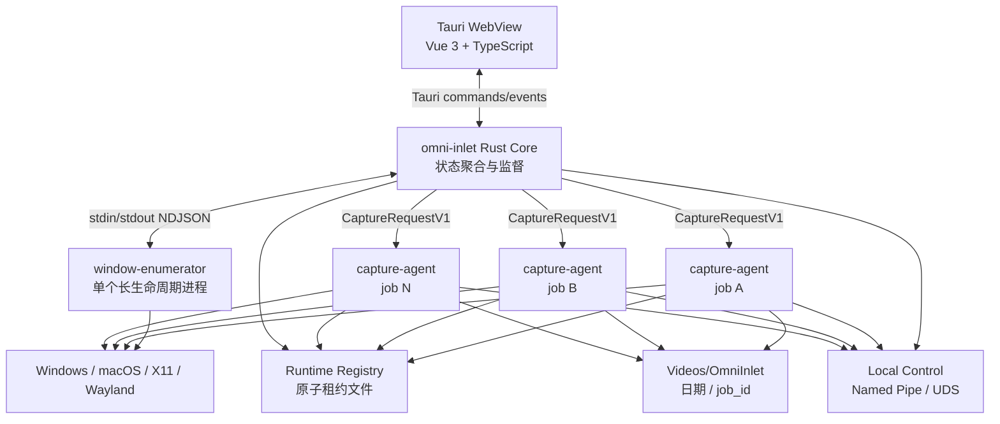
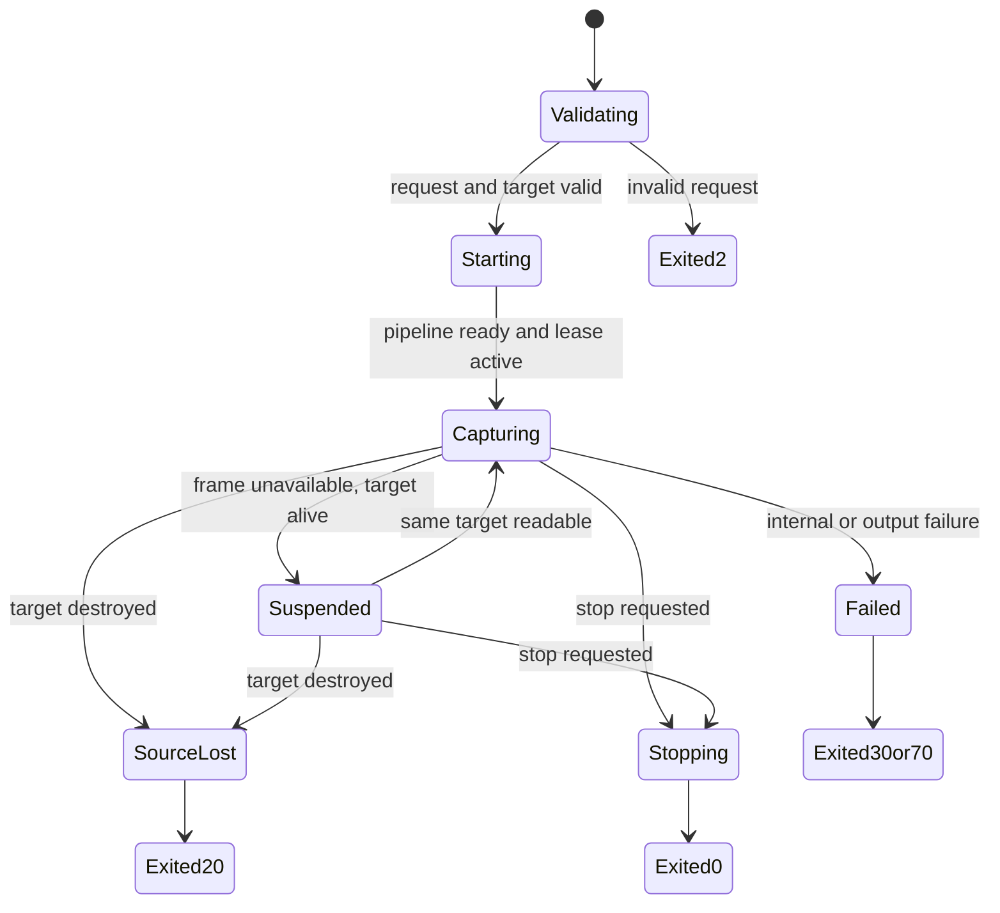

# OmniInlet 技术架构

状态：实现前设计基线
日期：2026-08-02
适用范围：跨平台窗口枚举、窗口选择、单窗口采集、多采集器实时计数与监督

## 1. 结论

OmniInlet 采用“三个可执行程序 + 共享 Rust 协议库”的本地架构：

1. `omni-inlet`：Tauri 2 桌面引导器，负责界面、状态聚合、启动和监督。
2. `window-enumerator`：平台窗口枚举器，负责窗口元数据、应用分组信息和按需缩略图。
3. `capture-agent`：无界面采集器，一个逻辑任务捕捉一个窗口，支持 GUI 和直接 CLI 两种启动方式。

不增加常驻中心服务。跨父进程的发现与实时计数使用当前用户运行时目录中的原子租约；控制使用本地命名管道或 Unix Domain Socket；父子进程的高频进度使用 NDJSON 标准输出。

界面上的“正在采集 (N)”统计的是该窗口对应的活跃逻辑采集任务数，不是历史次数，也不是简单 PID 数。

## 2. 架构原则

- 窗口身份是临时实例身份，不能把标题或窗口 ID 当作永久业务主键。
- `capture-agent` 必须可以脱离 GUI 独立运行。
- GUI 崩溃或重启后，必须能从租约恢复当前计数。
- 枚举器崩溃不能影响已经运行的采集器。
- 目标窗口真正销毁时，采集器写出终止事件并以退出码 `20` 退出。
- 窗口最小化或隐藏但实例仍存在时，采集器进入暂停，不伪造重复帧。
- 多个采集器允许捕捉同一个窗口，但每个任务拥有独占输出目录。
- 前端不获得任意 Shell 执行权限；所有子进程操作由 Tauri Rust 后端完成。
- 第一版不依赖 Python、云服务、数据库和收费组件。

## 3. 进程拓扑



### 3.1 为什么不把三个程序合成一个

- 平台枚举和缩略图更新可能失败或泄漏资源；独立进程可以直接重启。
- 单个采集任务崩溃不会拖垮其他窗口。
- CLI 用户可以不启动 GUI。
- 平台权限、退出码和日志边界更清楚。
- 后续本地视觉模型可以作为第四种消费者加入，不必进入捕捉进程。

### 3.2 为什么不增加注册中心进程

计数只需要在同一用户、同一台电脑、同一桌面会话内最终一致。原子租约加周期校准足以覆盖，增加守护进程会引入安装、开机启动、升级和故障恢复成本。

## 4. GUI 技术选择

### 4.1 选择

- 桌面壳：Tauri 2。
- Rust 后端：子进程监督、租约聚合、文件路径、平台权限和控制通道。
- 前端：Vue 3 + TypeScript + Vite。
- 前端状态：Pinia，只保存窗口投影、当前选择、过滤条件和应用折叠状态。
- 状态原则：Rust Core 保存权威运行状态，前端只持有可重建的界面投影。

Vue 组件采用 Composition API 和 `<script setup lang="ts">`。首屏包含上百窗口的虚拟列表、应用折叠、搜索、过滤和实时增量更新；Pinia 负责组织可重建的界面状态，但不保存权威采集计数。Tauri 支持把外部二进制作为 sidecar 打入安装包，并从 Rust 侧读取 stdout 事件，适合当前三个程序的边界。

### 4.2 前端不能做的事

- 不能直接拼接命令行和启动进程。
- 不能读取任意本地文件。
- 不能信任来自缩略图路径、窗口标题和进程名称的 HTML。
- 不能自己计算“正在采集 (N)”；只展示 Rust Core 聚合结果。
- 不能把 Pinia 持久化数据当作采集器运行事实；刷新后必须从 Rust Core 重建。

### 4.3 大列表渲染

- 应用组按稳定 `application_group_key` 排序。
- 组内按规范化标题、首次观察序号排序。
- 折叠状态只保存在 GUI 用户配置中。
- 搜索命中折叠组时临时展开，清空搜索后恢复之前状态。
- 使用 Vue 虚拟滚动组件，只渲染可视区附近的窗口卡片。
- GUI 将“可视窗口集合”反馈给枚举器，只为这些候选项刷新缩略图。

## 5. 权威数据模型

### 5.1 标识符

| 名称 | 生命周期 | 生成者 | 用途 |
| --- | --- | --- | --- |
| `candidate_id` | 一次枚举器生命周期 | 枚举器 | GUI 列表增删改 |
| `target_instance_key` | 原生窗口实例生命周期 | 枚举器或采集器 | 跨进程聚合同一窗口 |
| `capture_job_id` | 一次逻辑采集任务，包括自动重启 | 引导器或 CLI | 计数和监督 |
| `agent_instance_id` | 一次具体进程尝试 | 采集器 | 区分重启前后的进程 |

### 5.2 TargetInstanceKey

`target_instance_key` 必须包含平台桌面会话和原生窗口实例，避免仅凭标题合并两个窗口：

```text
SHA-256(
  platform
  + desktop_session_id
  + native_target_kind
  + native_target_value
  + owner_process_start_identity_if_available
)
```

平台输入：

- Windows：登录会话/桌面、`HWND`、所有者 PID、进程创建时间。
- macOS：登录会话、`CGWindowID`、所有者 PID、进程启动身份。
- X11：`DISPLAY`、XID、`_NET_WM_PID`（若存在）。
- Wayland：Portal session、stream opaque id/serial；不把可复用的 PipeWire node ID单独作为身份。

标题、窗口类、Bundle ID、可执行路径只用于展示和人工重新选择，不参与把已经销毁的新窗口自动认作旧窗口。

## 6. 实时计数架构

### 6.1 统计定义

```text
window.active_capture_count =
    count(distinct capture_job_id)
    where lease.target_instance_key == window.target_instance_key
      and lease is fresh
      and lease.state is active
```

活跃状态包括：

- `starting`：窗口已经验证，正在建立捕捉管线。
- `capturing`：正在产生帧。
- `suspended`：窗口仍存在但暂时不可读取。
- `stopping`：已请求停止但进程尚未结束。

`invalid`、`source_lost`、`failed`、`stopped` 不计数。`restarting` 是引导器状态，不是有效采集租约；重启成功前在详情面板显示异常，不计入“正在采集”。

界面规则：

- `0`：无标签，属于“未采集”。
- `1`：显示“正在采集”。
- `N > 1`：显示“正在采集 (N)”。
- 过滤器“正在采集 43”中的 `43` 是窗口数，不是所有 agent 数量之和。

### 6.2 为什么按 job 去重

自动拉起会产生新的 `agent_instance_id`。旧进程退出和新进程启动可能短暂重叠，如果直接数 PID 或租约文件会出现 `1 → 2 → 1` 的错误跳变。相同 `capture_job_id` 的多个 generation 只选择最新且进程身份有效的一条。

命令行每执行一次默认生成新的 `capture_job_id`，所以同时运行四条 CLI 命令会正确显示“正在采集 (4)”。用户也可以显式传入 `--job-id`，但重复使用活跃 job ID 必须拒绝。

### 6.3 AgentLeaseV1

```json
{
  "schemaVersion": 1,
  "captureJobId": "01J4JOB...",
  "agentInstanceId": "01J4AGENT...",
  "generation": 1,
  "pid": 43120,
  "processStartIdentity": "windows-filetime:133...",
  "targetInstanceKey": "sha256:...",
  "nativeTarget": {
    "kind": "windows-hwnd",
    "value": "0x000A032C"
  },
  "state": "capturing",
  "outputDirectory": "C:/Users/user/Videos/OmniInlet/2026-08-02/01J4JOB",
  "startedAtUnixMs": 1785646831000,
  "heartbeatAtUnixMs": 1785646835000,
  "sequence": 12,
  "controlEndpoint": "pipe:omni-inlet-01J4JOB"
}
```

### 6.4 租约存储

运行时根目录：

- Windows：当前用户 Local App Data 下的 `OmniInlet/runtime`。
- macOS：当前用户 Application Support 下的 `OmniInlet/runtime`。
- Linux：`XDG_RUNTIME_DIR/omni-inlet`，不可用时回退到用户缓存目录并收紧权限。

布局：

```text
runtime/
├── agents/
│   └── <capture_job_id>-<agent_instance_id>.json
├── control/
├── requests/
└── thumbnails/
```

写入过程：同目录创建临时文件、写入、flush、按需要 `sync_data`、原子 rename。目录和文件只允许当前用户访问。

### 6.5 心跳和脏租约

- 心跳周期：2 秒。
- 新鲜阈值：6 秒。
- GUI 使用文件系统通知实现低延迟刷新，同时每 2 秒全量校准，不能只依赖文件通知。
- 心跳超过 6 秒后，校验 PID 与 `processStartIdentity`，防止 PID 复用。
- 进程不存在或身份不匹配：删除脏租约。
- 进程仍存在但心跳停止：不计入“正在采集”，详情显示“采集器无响应”，交给监督器处理。
- 系统睡眠恢复后先做进程身份校准，再判断超时，避免一次性误删全部租约。

### 6.6 聚合算法

Rust Core 维护：

```text
windows: HashMap<TargetInstanceKey, WindowCandidate>
leases:  HashMap<AgentInstanceId, AgentLease>
jobs:    HashMap<CaptureJobId, EffectiveJobLease>
counts:  HashMap<TargetInstanceKey, u32>
```

任何窗口或租约变化时只重新计算受影响的两个 target key。每 2 秒执行一次完整折叠作为纠错。聚合结果携带单调递增 `revision`，前端忽略旧 revision，避免异步事件倒序覆盖。

## 7. 进程通信

### 7.1 Launcher 与 Enumerator

一个长生命周期枚举器，stdin 接收命令，stdout 输出 NDJSON：

命令：

- `refresh`
- `set_thumbnail_interest`
- `set_thumbnail_size`
- `shutdown`

事件：

- `enumerator_ready`
- `snapshot_started`
- `window_upserted`
- `window_removed`
- `thumbnail_updated`
- `snapshot_finished`
- `enumerator_warning`
- `heartbeat`

缩略图不使用 Base64 进入 JSON，只传当前用户临时目录中的受控文件路径、内容哈希和 revision。

### 7.2 Launcher 与 Capture Agent

启动请求有两种形式：

```bash
capture-agent run --request <capture-request.json>
```

或：

```bash
capture-agent run \
  --target-kind windows-hwnd \
  --window-id 0x000A032C \
  --output ".../2026-08-02/01J4JOB" \
  --fps 10 \
  --segment-seconds 5
```

父进程启动的 agent 通过 stdout NDJSON 提供即时事件。所有 agent，包括直接 CLI 启动者，都创建本地控制端点：

- Windows：当前用户 ACL 保护的 Named Pipe。
- macOS/Linux：权限为 `0600` 的 Unix Domain Socket。

第一版控制命令：`status`、`stop`。不开放 TCP 端口。

### 7.3 Launcher 与 WebView

WebView 只能调用明确的 Tauri command：

- `get_window_projection`
- `select_window`
- `start_capture`
- `stop_capture_job`
- `stop_all_for_window`
- `choose_output_directory`
- `open_output_directory`
- `set_filter`
- `set_group_collapsed`

Rust Core 将高频原生事件在 50–100 ms 窗口内合并后再通知前端，避免上百窗口更新导致重绘风暴。

## 8. 捕捉器状态机



顺序要求：

1. 解析并校验完整请求。
2. 独占创建输出目录。
3. 校验目标窗口仍存在且身份匹配。
4. 创建控制端点。
5. 写入活跃租约。
6. 初始化视频编码器，原子写入 `meta.json`。
7. 开始捕捉并持久化 5 秒视频分片。

任何一步失败都不能留下“正在采集”租约。

一次取帧失败后先执行平台存活检查：

- 目标存在但不可读取：进入 `suspended`，保留租约和计数。
- 目标实例不存在：写 `source_lost`，删除租约，以 `20` 退出。
- 平台接口或进程内部错误：按错误类型以 `70` 或其他明确退出码退出。

## 9. 引导器监督策略

### 9.1 退出码

| 退出码 | 意义 | 自动重启 |
| --- | --- | --- |
| `0` | 正常停止 | 否 |
| `2` | 请求无效 | 否 |
| `20` | 原生窗口丢失 | 否 |
| `21` | 捕捉权限丢失 | 否 |
| `30` | 输出或磁盘错误 | 否 |
| `70` | 内部瞬时故障 | 是，最多 3 次 |

### 9.2 重启

- 自动重启沿用同一个 `capture_job_id`，`generation + 1`，创建新的 `agent_instance_id`。
- 必须确认旧进程已经退出，并让枚举器确认原 `target_instance_key` 仍存在。
- 退避时间：1 秒、3 秒、10 秒。
- 三次失败后进入终态，不继续拉起。
- `source_lost` 永远不能通过搜索相同标题自动替换目标。

### 9.3 引导器自身退出

- 关闭主窗口默认隐藏到托盘，监督器继续运行。
- 显式退出时允许用户选择“停止所有托管任务”或“让采集器继续运行”。
- 采集器必须验证为可脱离父进程存活；引导器重新启动后通过租约恢复任务列表和计数。
- 枚举器始终属于引导器，引导器退出时一并结束。

## 10. 窗口枚举与缩略图

“所有窗口”定义为当前桌面会话中可由系统 API 捕捉的用户顶层窗口，不包括引导器自身、桌面外壳、菜单、工具提示、零尺寸窗口和无身份的系统内部窗口。

枚举器分开处理元数据与缩略图：

- 元数据每 1 秒校准，也订阅平台窗口增删事件。
- 新窗口立即产生候选项，不等待缩略图完成。
- 首次只为可视区、选中项和搜索命中项生成缩略图。
- GUI 发送 `thumbnail_interest` 后，枚举器以有限并发更新对应缩略图。
- 缩略图默认最大 384×216，保持原比例，不拉伸。
- 同一 revision 内容哈希未变化时不通知前端。
- 缩略图缓存只位于运行时目录，正常退出和启动清理过期文件。

这一设计避免启动时同时截取上百个全尺寸窗口。

## 11. 平台适配

### 11.1 Windows，第一生产优先级

- 枚举：`EnumWindows`、窗口可见性、标题、类名和所有者进程。
- 捕捉：Windows Graphics Capture，通过 `HWND` 创建 `GraphicsCaptureItem`。
- 丢失：`GraphicsCaptureItem.Closed` 加 `IsWindow` 和所有者进程身份复核。
- 实现：Rust `windows` 绑定直接调用系统 API，不使用通用截图库。

Windows 官方接口允许从 `HWND` 创建单窗口捕捉项；系统还明确说明某些应用会替换窗口并触发 `Closed`，因此退出必须绑定原实例而不是仅判断进程是否仍在。

### 11.2 macOS

- 枚举：`SCShareableContent` 的 applications/windows。
- 捕捉：`SCWindow` + `SCContentFilter` + `SCStream`。
- 缩略图：ScreenCaptureKit 截图接口。
- 丢失：重新读取 shareable content，并核对原 `CGWindowID`。
- 实现：Rust Core 加极薄的 Swift/Objective-C C ABI 桥；桥只包装官方 ScreenCaptureKit，不承载业务状态。

### 11.3 Linux X11

- 枚举和第一版捕捉继续使用当前 `x11rb` 实现。
- `MapState::VIEWABLE` 区分可读取与隐藏。
- `BadWindow` 表示实例销毁；不可查看但仍存在进入暂停。
- 当前 `XGetImage` 对遮挡和 backing store 有限制，不能把它承诺成与 Windows/macOS 完全一致的离屏捕捉。

### 11.4 Linux Wayland

Wayland Portal 支持让用户在系统选择器中选择窗口并返回 PipeWire 流，但不向普通应用暴露一个可任意枚举全部窗口的跨桌面标准接口。因此：

- 自定义“所有窗口网格”第一版只在 Windows、macOS 和 X11 完整提供。
- Wayland 进入降级模式，调用系统 Portal 选择器。
- Portal 返回的 stream id/serial 和 restore token 进入 `nativeTarget`。
- 专用 Linux 采集电脑如果必须使用自定义窗口网格，第一阶段要求使用 Xorg 会话。

这不是实现缺口可以绕过的普通库选择问题，而是 Wayland 的权限模型边界。

## 12. 输出布局

引导器解析系统视频目录并追加 `OmniInlet`：

```text
Videos/OmniInlet/
└── 2026-08-02/
    └── 01J4JOB/
        ├── meta.json
        ├── events.json
        └── videos/
            ├── 00000001.mkv
            ├── 00000002.mkv
            └── 00000003.mkv
```

目录层级含义：

- 日期目录：方便运维按天查找，不参与数据身份判断。
- job 目录：目录名严格等于 `capture_job_id`，不增加应用、窗口标题或其他维度。
- `meta.json`：job 级静态元信息，内容是标准 JSON。编码器初始化成功后写入临时文件，再原子 rename 为 `meta.json`；此后只读。
- `events.json`：job 的动态运行事件和视频分片索引，内容是标准 JSON 对象，事件放在 `events` 数组中。记录启动、重启、暂停、恢复、分片提交、窗口丢失和停止，不存放 OCR 识别后的聊天消息。每次更新通过临时文件加原子 rename 提交，避免留下半个 JSON 文档。
- `videos/`：采集器的原始持久化产物。默认每 5 秒产生一个 MKV 分片，文件序号在整个 job 内单调递增。

多个采集器捕捉同一窗口时，每次启动都有不同的 `capture_job_id`，因此不会写入同一 job 目录。一个 job 因内部错误自动重启时保持 `capture_job_id`，新进程从已提交的最大分片序号继续写入，不覆盖旧数据。

正常分片先写入临时文件，完成封装后原子 rename 为八位数字文件名，然后向 `events.json` 写入 `video.segment.completed` 事件。窗口丢失或用户停止时尝试安全封装当前分片；进程突然崩溃时最多影响当前 5 秒的临时分片。

帧只是后续处理器解码视频时的内存中间数据，不由采集器持久化。画面去重、长图拼接、聊天段落切分、OCR 和身份补全属于后续消费者，通过 job ID、分片序号和时间戳回指原始视频。

运行时租约、控制 socket、启动请求临时文件和窗口缩略图不写入视频目录，而是放在可清理的系统运行时目录：

```text
OmniInlet/runtime/
├── agents/
├── control/
├── requests/
└── thumbnails/
```

`meta.json` 至少固化下列内容：

```json
{
  "schemaVersion": 1,
  "jobId": "01J4JOB",
  "createdAt": "2026-08-02T10:00:00+08:00",
  "target": {
    "platform": "windows",
    "kind": "windows-hwnd",
    "windowId": "0x000A032C",
    "applicationName": "WeChat",
    "windowTitle": "项目讨论群"
  },
  "capture": {
    "width": 1920,
    "height": 1080,
    "fps": 10
  },
  "video": {
    "container": "matroska",
    "fileExtension": "mkv",
    "codec": "h264",
    "framework": "ffmpeg-dynamic",
    "encoder": "libopenh264",
    "pixelFormat": "yuv420p",
    "rateControl": "cbr",
    "bitrateKbps": 2048,
    "speedPreset": "low-complexity",
    "tune": "screen-content",
    "audio": false,
    "encodedWidth": 1920,
    "encodedHeight": 1080,
    "segmentDurationMs": 5000,
    "keyFrameIntervalFrames": 50
  }
}
```

`video.encoder` 记录编码管线实际选中的编码器，不是用户请求中的 `auto`。码率、速度预设、tune、GOP、硬件加速和色彩空间等字段必须记录实际生效值。

## 13. 容量模型

一个 1920×1080 RGBA 帧约 7.91 MiB；10 FPS 时单窗口进入编码前约处理 79.1 MiB/s 原始像素，100 个窗口约 7.72 GiB/s，尚未计入视频编码和磁盘写入。

因此：

- 界面和计数支持上百窗口，不代表默认允许上百个 10 FPS 任务无告警运行。
- 引导器实时计算 `Σ(width × height × fps)`、活跃任务数、磁盘剩余空间和最近写入速率。
- 超过配置阈值时给出资源警告，但第一版不偷偷修改用户 FPS，也不合并任务。
- 每个 agent 保持有界帧队列；消费者落后时丢弃调度债务，不无限堆内存。
- 同一窗口的多个 agent 完全独立编码和写盘，数量必须真实反映资源成本。
- 后续可以增加“空闲低帧率、画面变化时升频”，但不进入第一版语义。

## 14. 采集器内部模块

第一阶段不把协议、租约、输出和核心循环拆成独立 crate。它们是同一个 `capture-agent` library crate 中的普通 Rust module：

- `protocol.rs`：`CaptureRequestV1`、枚举事件、采集事件、退出码。
- `registry.rs`：租约、进程身份、心跳和计数聚合。
- `output.rs`：job 目录、`meta.json`、`events.json` 和视频分片的原子提交。
- `capture.rs`：捕捉循环、视频编码、暂停、窗口丢失和分片提交。
- `platform/mod.rs`：窗口数据类型和平台能力 trait。

平台实现也是同一个 crate 下的条件编译 module：

- `platform/windows/`：Windows 枚举、缩略图、WGC 捕捉和存活检查。
- `platform/macos/`：macOS ScreenCaptureKit 枚举、缩略图、捕捉和存活检查。
- `platform/linux/x11/`：X11 枚举、`GetImage` 捕捉、像素转换和存活检查。
- `platform/linux/wayland/`：Wayland Portal/PipeWire 降级能力。
- `platform/test_pattern.rs`：跨平台、无桌面环境的确定性测试适配器。

平台 module 实现同一组接口：

```rust
trait WindowCatalogBackend { /* enumerate and observe */ }
trait WindowThumbnailBackend { /* thumbnail on demand */ }
trait WindowCaptureBackend { /* open one capture source */ }
trait TargetLivenessBackend { /* alive, hidden, or destroyed */ }
```

`capture-agent` 和 `window-enumerator` 是同一个 Cargo package 的两个 binary target，共享这些 module。通过 `#[cfg(target_os = ...)]` 和 Cargo target-specific dependencies 只编译当前平台。平台 module 之间禁止相互调用，公共逻辑上提到 `platform/mod.rs` 或其他顶层 module。

只有满足以下条件之一，普通 module 才升级为独立 crate：需要被另一个产品复用、需要独立版本、必须产生独立构建产物，或者 target-specific dependency 已严重拖累构建。目前均不满足。

进程启动、控制、退出码解释和重启策略属于引导器职责，实现在 `launcher/src-tauri/src/supervisor/`，不放入采集器共享 crate。

所有跨进程 JSON 都包含 `schemaVersion`。同一主版本允许忽略未知字段；不支持的主版本必须在启动时失败，不能静默猜测。

## 15. 仓库结构

```text
omni-inlet/
├── docs/
├── launcher/
│   ├── package.json
│   ├── pnpm-lock.yaml
│   ├── src/                      # Vue 3 + TypeScript + Pinia
│   └── src-tauri/
│       ├── src/supervisor/       # 启动、监控、控制和重启
│       └── binaries/             # 打包时暂存 sidecar
├── capture-agent/
│   ├── Cargo.toml                # 一个 library + 两个 binary target
│   ├── .cargo/config.toml
│   ├── src/
│   │   ├── lib.rs
│   │   ├── protocol.rs
│   │   ├── registry.rs
│   │   ├── output.rs
│   │   ├── capture.rs
│   │   ├── bin/
│   │   │   ├── capture-agent.rs
│   │   │   └── window-enumerator.rs
│   │   └── platform/
│   │       ├── mod.rs            # 公共 trait、类型和平台 factory
│   │       ├── windows/
│   │       │   ├── mod.rs
│   │       │   ├── enumerate.rs
│   │       │   ├── thumbnail.rs
│   │       │   ├── capture.rs
│   │       │   └── liveness.rs
│   │       ├── macos/
│   │       │   ├── mod.rs
│   │       │   └── native/       # 必要时放极薄 Swift/ObjC 桥
│   │       ├── linux/
│   │       │   ├── mod.rs
│   │       │   ├── x11/
│   │       │   └── wayland/
│   │       └── test_pattern.rs
│   ├── contracts/                # JSON Schema 和跨进程示例
│   ├── xtask/                    # 唯一额外 crate，仅用于构建工具
│   └── dist/
├── .gitignore
└── .git/
```

`omni-inlet` 根目录只统一管理 Git 和产品文档，不建立根 Cargo workspace。`launcher` 和 `capture-agent` 是两个清晰的构建边界：

- `launcher` 拥有 Tauri/Vue 界面、监督器和最终桌面安装包。
- `capture-agent` 一个 package 产生 `capture-agent`、`window-enumerator` 两个子程序，并提供捕获命令总入口 `omni-inlet`；三个程序都安装到 `app/bin/`。
- `launcher/src-tauri` 可以通过 path dependency 使用 `capture-agent` library 暴露的协议和租约读取接口，但 `capture-agent` 不反向依赖 launcher。
- 现有 `capture-agent` Rust workspace 保留，不再提升到产品根目录。

## 16. 构建与打包

采集子系统入口保持在采集器目录：

```bash
cd capture-agent
cargo xtask doctor
cargo xtask test
cargo xtask build
cargo xtask package --target current
```

权威产物是解压即用的绿色软件目录：

```text
dist/<version>/<target>/app/
├── omni-inlet                 # launcher 生成的 GUI 入口
├── bin/
│   ├── omni-inlet             # 捕获命令总入口
│   ├── capture-agent
│   └── window-enumerator
├── lib/
│   ├── capture-runtime.*      # 产品自有运行时：枚举、采集、任务与编码实现
│   └── FFmpeg/OpenH264 动态库 # capture-runtime 的第三方运行依赖
├── resources/
└── licenses/
```

根目录只有一个用户入口；`bin/` 只放可执行入口和薄启动壳；产品自有运行时与第三方动态运行库都放在 `lib/`。当前 `capture-agent` 和 `window-enumerator` 的实际功能统一进入 `capture-runtime`，壳程序按自身绝对位置加载它，不读取系统 `PATH`。`lib/` 内部是否二次分目录，由后续具体依赖决定。安装器、ZIP、DMG 和 AppImage 只能重新封装或复制这个 `app/`，不再发明第二套目录。

`capture-agent/cargo xtask package` 只负责准备 `app/bin/` 下的三个捕获程序；产品级打包由 Tauri/Vue 引导器在根目录写入 GUI `omni-inlet`，再封装完整 `app/`。

发布包必须在目标系统完成最终验证：

- Windows：MSVC、WebView2、WGC 实机。
- macOS：Xcode、Screen Recording 权限、签名/公证。
- Linux X11：目标发行版 WebKitGTK 和 Xorg。
- Linux Wayland：只验证 Portal 降级流程，不声明完整网格能力。

## 17. 测试架构

### 17.1 不依赖 GUI 的确定性测试

- `test-pattern` 保留为端到端采集源。
- 租约折叠纯函数测试：重复 job、generation、过期、PID 复用、睡眠恢复。
- 同一窗口 1/4/N 个 job 的计数测试。
- worker 窗口丢失产生 `source_lost` 和退出码 20。
- 内部错误退出码 70，监督器最多重启三次。
- 多 agent 输出目录互不覆盖。

### 17.2 GUI 测试

- 1,000 个模拟窗口的虚拟滚动。
- 应用折叠、全部折叠、搜索临时展开。
- `全部 / 未采集 / 正在采集`过滤。
- revision 倒序事件不能覆盖新状态。
- agent 启动/退出时标签从无 → 正在采集 → 正在采集 (4) → 无。

### 17.3 平台契约测试

- Windows、macOS、Linux X11 分别使用真实窗口测试枚举、缩略图、隐藏、恢复和销毁。
- 平台测试必须在原生目标机运行；WSL 的 `test-pattern` 只验证公共管线，不能替代真实窗口测试。

## 18. 实施顺序

1. 把现有协议扩展为 `CaptureRequestV1`、明确退出码和 `source_lost`。
2. 在 `capture-agent/src/registry.rs` 实现租约和纯计数测试。
3. 把当前 `capture-worker/src/x11.rs` 迁移到 `src/platform/linux/x11/`，保持现有捕捉逻辑不变。
4. 在 `src/platform/mod.rs` 建立公共 traits，并迁移 `test_pattern.rs` 和 X11 枚举逻辑。
5. 在 `launcher` 内实现 Tauri Rust Core 和 supervisor，在没有完整视觉 UI 前先验证多进程监督。
6. 按已确认设计实现 Vue 3 首屏、Pinia 界面状态、折叠、过滤和实时计数。
7. 完成 Windows WGC 生产后端。
8. 完成 macOS ScreenCaptureKit 后端。
9. 完成 Linux Wayland Portal 降级入口。
10. 在三套原生构建机上打包和验收。

## 19. 第一阶段完成定义

- GUI 能展示 100+ 模拟窗口而不明显卡顿。
- GUI、直接 CLI 启动的 agent 都能进入统一实时计数。
- 同一窗口四个 job 稳定显示“正在采集 (4)”。
- 任一 agent 异常退出后，计数能在租约超时和进程校验后自动纠正。
- 窗口隐藏时 agent 保持；窗口真正销毁时 agent 以 20 退出且计数归零。
- 枚举器重启不影响采集器。
- GUI 重启能从租约恢复任务和计数。
- 每个 job 写入独占目录和可连续消费的 5 秒 MKV 视频分片。
- `capture-agent/cargo xtask package --target current` 产生采集子系统的 `app/bin/` 内容；引导器构建补入根目录 GUI 后才形成完整绿色 `app/`。

## 20. 官方能力依据

- Tauri 2 支持把外部可执行程序作为 sidecar 打入应用，并从 Rust 侧启动和接收 stdout 事件：<https://v2.tauri.app/develop/sidecar/>。
- Windows Graphics Capture 支持从 `HWND` 创建单窗口 `GraphicsCaptureItem`：<https://learn.microsoft.com/windows/win32/api/windows.graphics.capture.interop/nf-windows-graphics-capture-interop-igraphicscaptureiteminterop-createforwindow>。
- Windows 的 `GraphicsCaptureItem.Closed` 会在目标关闭或被应用替换时触发：<https://learn.microsoft.com/uwp/api/windows.graphics.capture.graphicscaptureitem.closed>。
- macOS `SCShareableContent` 提供可捕捉的 displays、applications 和 windows：<https://developer.apple.com/documentation/screencapturekit/scshareablecontent>。
- X11 `XGetImage` 要求目标窗口可查看，隐藏和遮挡存在明确限制：<https://www.x.org/archive/X11R7.5/doc/man/man3/XGetImage.3.html>。
- Wayland ScreenCast Portal 通过系统选择器选择 WINDOW source，并返回 PipeWire stream，而不是允许普通应用任意枚举窗口：<https://flatpak.github.io/xdg-desktop-portal/docs/doc-org.freedesktop.portal.ScreenCast.html>。
